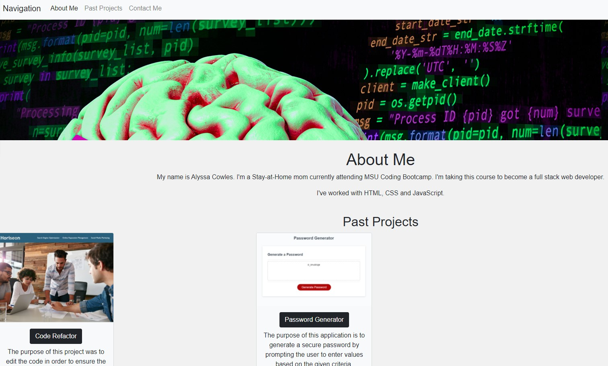

# 02 Advanced CSS: Portfolio

## Description

The purpose of this project was to develop a functional and responsive Portfolio website.

## Deployed Application

https://am-cowles.github.io/Portfolio/

## User Story

```
AS AN employer
I WANT to view a potential employee's deployed portfolio of work samples
SO THAT I can review samples of their work and assess whether they're a good candidate for an open position
```

## Screenshot

The following image shows the deployed application's appearance and functionality.

